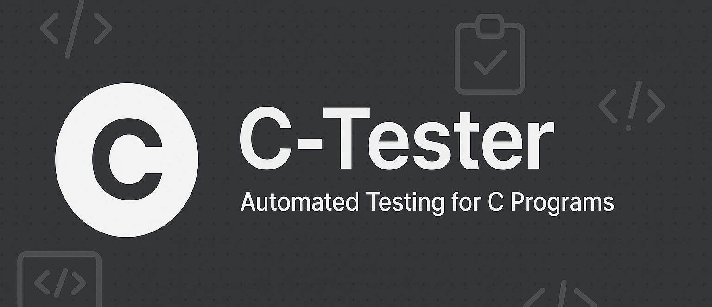
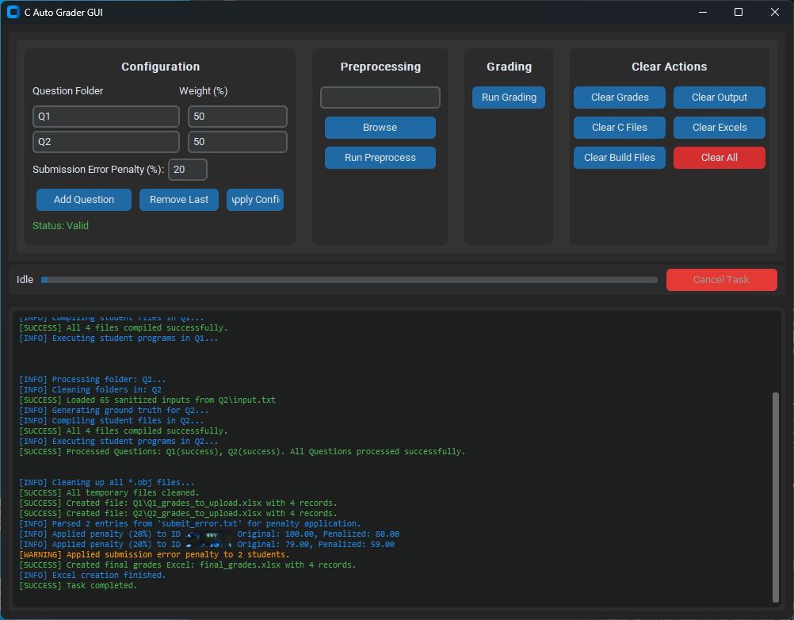
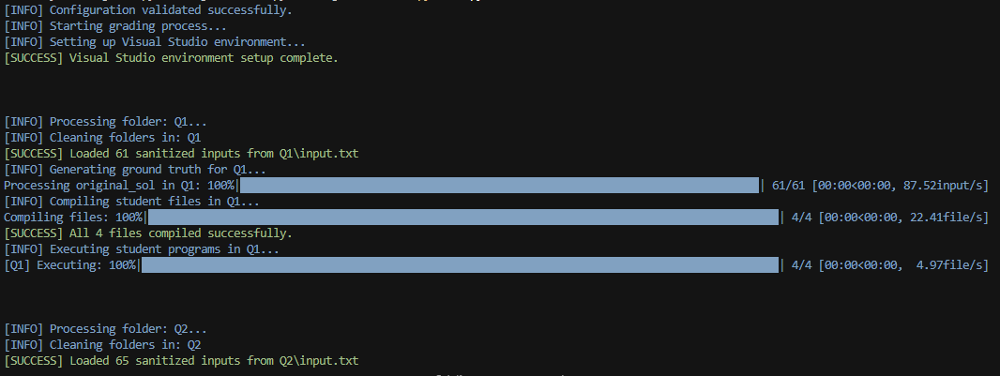

# C Auto Grader



*An automated tool for grading C programming assignments with GUI and CLI interfaces.*

[](https://www.python.org/)
[](https://opensource.org/licenses/MIT)
[](https://github.com/sagy101/C-Tester/issues) 
<!-- Add other badges here if needed (e.g., build status, coverage, version) -->

This project automates the batch grading of multiple C programs. It sets up the Visual Studio C++ build environment, compiles and executes student C source files against a known-correct solution, compares outputs, and produces grading reports. Additionally, it generates Excel files with detailed grade breakdowns for each question folder as well as a consolidated final grade file for easy uploading (e.g. Moodle). 

---

## 🆕 Recent Updates

### Enhanced Validation Features (September 2023)
- **Improved Path Validation**: Added automatic validation of Visual Studio and WinRAR paths before operations begin
- **Automatic Button Disabling**: 
  - Run Grading is disabled until the VS path is validated
  - Preprocess is disabled if no ZIP file is selected or if RAR support is enabled with an invalid WinRAR path
- **CLI Validation**: Added VS path and WinRAR path validation to command-line operations
- **Better Error Messages**: More informative error messages with clear guidance when validation fails

### Configuration Improvements (August 2023)
- **Centralized Configuration**: Visual Studio path (`vs_path`) moved from `Process.py` to `configuration.py` for easier setup
- **Default Configuration**: Questions list and folder weights expanded to include five questions (Q1-Q5) with equal 20% weights
- **Improved Error Handling**: Enhanced submission error parsing with better logging for troubleshooting

### GUI Enhancements (May 2023)
- **Modernized Interface**: A completely redesigned UI with a more intuitive and visually appealing layout
- **Enhanced Visuals**: Improved color scheme, button styling, and visual feedback for actions
- **Better Layout**: Reorganized controls into logical sections with improved spacing and readability
- **Emoji Icons**: Added visual indicators to make sections easier to identify
- **RAR Support Integration**: Moved RAR support settings to preprocessing section for better usability
- **Progress Indicators**: Enhanced progress reporting with percentage display
- **Responsive Design**: Better minimum window size constraints to prevent text cutoff
- **Error Feedback**: Clearer visual feedback for configuration validation and error states

---

## ✨ Features

*   **Preprocessing:** Extracts student submissions from nested zip files, organizes C files (`*_qN.c`) into question folders (`QN/C/`), and renames them based on student ID. Reports processing issues.
    *   **New:** Now supports RAR archives in addition to ZIP files.
    *   **New:** Supports simple naming pattern (`hwN.c`) as an alternative to the default pattern (`hwN_qN.c`).
*   **Automated Grading:**
    *   Sets up the Visual Studio C++ build environment (`vcvars64.bat`).
    *   Compiles student C code and a provided `original_sol.c` using `cl.exe`.
    *   Runs compiled student code against inputs from `input.txt`.
    *   Compares student output against the ground truth generated from `original_sol.c`.
    *   Robust timeout handling for infinite loops and long-running code (5-second limit).
    *   Detailed tracking of which inputs caused timeouts.
*   **Excel Reporting:**
    *   Generates detailed Excel reports per question (`QN_grades_to_upload.xlsx`).
    *   Creates a consolidated `final_grades.xlsx` with weighted averages.
    *   Applies penalties based on preprocessing errors (`submit_error.txt`).
    *   Flexible penalty modes: apply once per student or cumulatively per error.
    *   Lists failed test cases and timeout-causing inputs in the Comments column.
    *   Optional "slim" mode for final grades only.
*   **Dual Interface:**
    *   Modern GUI (`gui.py`) for interactive use with progress display and cancellation.
    *   Robust CLI (`main.py`) for scripting and automation.
*   **Advanced Validation:**
    *   Automatically validates Visual Studio and WinRAR paths before operations.
    *   Input validation for ZIP file selection and configuration settings.
    *   Clear status messages and button state management based on validation.
*   **Flexible Configuration:** Define questions, weights, penalties, and penalty modes in `configuration.py` or override via the GUI.
*   **Cleanup Utilities:** Easily clear generated files (grades, output, C copies, build files, excels) via GUI or CLI.

---

## 🖼️ Screenshots

**Graphical User Interface (GUI):**



**Command Line Interface (CLI) Example Output:**



---

## 🔧 Requirements

*   **Operating System:** Windows (uses `cmd` and Visual Studio's C++ compiler)
*   **Visual Studio 2022:** Community or higher, with C++ build tools installed.
    *   The path to `vcvars64.bat` is now configured in `configuration.py` (default: `C:\Program Files\Microsoft Visual Studio\2022\Community\VC\Auxiliary\Build\vcvars64.bat`).
*   **Python 3:** Tested with Python 3.10+. Tcl/Tk support required for the GUI (usually included with standard python.org installations - select "tcl/tk and IDLE" during setup/modify).
*   **For RAR support:** 
    *   The `rarfile` Python package (included in requirements.txt)
    *   WinRAR or UnRAR executable installed
    *   Path to WinRAR configured in `configuration.py` (default: `C:\Program Files\WinRAR\UnRAR.exe`)
*   **Dependencies:** Listed in `requirements.txt`.

---

## ⚙️ Installation

1.  **Clone** or download the project files.
2.  **Install** required Python dependencies (preferably within a virtual environment):
    ```bash
    # Create and activate a virtual environment (optional but recommended)
    python -m venv .venv
    # Activate (Windows PowerShell):
    .\.venv\Scripts\Activate.ps1
    # Activate (Git Bash / Linux / macOS):
    # source .venv/bin/activate 
    
    # Install dependencies
    pip install -r requirements.txt
    ```
3.  **Configure** paths in `configuration.py`:
    * Visual Studio path (`vs_path`): Point to your Visual Studio's vcvars64.bat file
    * WinRAR path (`winrar_path`): Point to your UnRAR.exe or WinRAR.exe (only needed for RAR support)
4.  **Prepare** Question Folders (see Structure below).

---

## 📁 Project Structure

*   `configuration.py`: Defines questions, weights, penalty, and per-error penalty flag. Also contains Visual Studio path (`vs_path`) and WinRAR path configuration. **Edit this for CLI configuration.**
*   `gui.py`: Entry point for the Graphical User Interface.
*   `main.py`: Entry point for the Command Line Interface.
*   `preprocess.py`: Logic for extracting and organizing student submissions.
*   `Process.py`: Handles VS environment setup, compilation, execution, and output comparison.
    *   Uses `vs_path` from `configuration.py` for Visual Studio environment setup.
    *   Includes robust timeout handling for student code execution.
    *   Aggressively terminates hung processes on Windows.
*   `CreateExcel.py`: Logic for generating individual and final Excel reports.
    *   Now includes timeout input tracking in both question-specific and final Excel files.
*   `clear_utils.py`: Functions for cleaning generated files.
*   `Utils.py`: Logging utility and verbosity settings.
*   `requirements.txt`: Project dependencies.
*   `README.md`: This file.
*   `docs/`: Contains documentation assets (like screenshots).
*   `Q*/`: Folders for each question (e.g., `Q1/`, `Q2/`).
    *   `input.txt`: Required file containing test case inputs (one per line).
    *   `original_sol.c`: Required file with the correct solution code.
    *   `C/`: **Initially empty.** Preprocessing places student `ID.c` files here.
    *   `grade/`: Generated text files with individual grades/errors.
        *   Now includes lists of inputs that caused timeouts.
    *   `output/`: Generated text files with student program output for each input.
    *   `Q*_grades_to_upload.xlsx`: Generated Excel report for the question.
        *   Now includes a "Timeout_Inputs" column.
*   `final_grades.xlsx`: Generated consolidated final grade report.
    *   Now includes "Timeout_Inputs_Q*" columns and timeout information in Comments.
*   `submit_error.txt`: Generated by preprocessing, lists submissions with issues.

---

## 📥 Input Data Structure

### Preprocessing Input Zip File

For the **Preprocessing** step (via GUI or CLI) to work correctly, the input zip file you provide must adhere to the following structure:

<details>
  <summary>View Expected Input Zip Structure</summary>
  
  1.  The main zip file should contain **individual zip or RAR files** for each student submission.
  2.  Each inner archive's name **must end with the student's ID number**, preceded by an underscore (e.g., `Student Name_Assign1_123456789.zip` or `Student Name_Assign1_123456789.rar`). The part before the underscore and ID is not used by default but helps organization.
  3.  When an inner archive (e.g., `Student Name_Assign1_123456789.zip`) is extracted, it creates a folder (`Student Name_Assign1_123456789/`).
  4.  Inside this folder, the script looks for C files named in one of two formats:
      * **Default Pattern:** `some_filename_qN.c`, where `N` is the question number (e.g., `main_program_q1.c`, `my_solution_q2.c`).
      * **Simple Pattern:** `hwN.c`, where `N` is the question number (e.g., `hw1.c`, `hw2.c`). Use this pattern by enabling the `--simple-naming` flag in CLI or the corresponding option in GUI.
  5.  **Alternatively**, if no matching C files are found directly inside the student's folder, the script will look for them inside **exactly one subdirectory** within the student's folder (e.g., `Student Name_Assign1_123456789/Submission/main_program_q1.c`). It will not search deeper than one subfolder level.
      
  **Example:**
  ```
  main_submissions.zip          <-- Input zip file
  │
  ├── FirstName_LastName_Assign1_123456789.zip
  │   │ # Extracted to folder FirstName_LastName_Assign1_123456789/
  │   └── main_code_q1.c
  │   └── helper_functions_q2.c
  │
  ├── Another_Student_Assign1_987654321.rar   <-- Now supports RAR files
  │   │ # Extracted to folder Another_Student_Assign1_987654321/
  │   └── SubmittedFiles/          <-- Single subfolder is OK
  │       ├── program_q1.c
  │       └── library_q2.c
  │       └── readme.txt
  │
  └── Problem_Student_Assign1_111223344.zip
      │ # Extracted to folder Problem_Student_Assign1_111223344/
      └── source.c                <-- File doesn't match _qN.c pattern, will cause error in submit_error.txt
  ```
  
  Submissions that don't follow this structure (e.g., missing ID in archive name, C files not matching `_qN.c` pattern, C files nested too deep, no C files found) **will not be processed correctly** and will be reported with errors in `submit_error.txt`.
</details>

### Question Folders (`Q*`)

For the **Grading** step, each question folder (e.g., `Q1`, `Q2`) defined in the configuration must exist and contain:

*   `input.txt`: File containing test case inputs (one per line).
*   `original_sol.c`: File with the correct solution code for generating ground truth output.

---

## 🚀 Usage

Choose the interface that suits your needs:

### Graphical User Interface (GUI)

Recommended for interactive use.

1.  **Run** the GUI script (ensure dependencies are installed and environment is activated):
    ```bash
    python gui.py
    ```
2.  **Configure (Optional):**
    *   The "Configuration" section displays the current questions and weights in a table.
    *   Modify folder names and weights directly in the table.
    *   Use "Add Question" to add a new empty row or "Remove Last" to delete the bottom row.
    *   Edit the "Submission Error Penalty" value in its field.
    *   Check "Apply penalty per error (cumulative)" if you want penalties to add up for each error a student has. Leave unchecked to apply only a single penalty per student regardless of error count.
    *   **Important:** After making any changes, click **"Apply Config"**. This will parse and validate your inputs.
        *   The **Status** label below the buttons will indicate if the current configuration is "Valid", "INVALID" (with details in a popup), or if there are "Unapplied changes".
        *   The "Apply Config" button will be highlighted if changes are unapplied.
        *   The "Run Preprocess" and "Run Grading" buttons are **disabled** if the configuration is invalid or has unapplied changes.
3.  **Set Dependencies:**
    *   The "Dependencies" section allows you to configure paths to required executables:
        *   **Visual Studio Path**: Path to your Visual Studio environment's vcvars64.bat file (required for grading).
        *   **WinRAR Path**: Path to your WinRAR.exe or UnRAR.exe (only required if RAR support is enabled).
    *   After setting or changing paths, click the corresponding "Apply" button to validate the path.
    *   The "Run Grading" button will be disabled until a valid VS path is applied.
    *   The "Run Preprocess" button will be disabled if RAR support is enabled but no valid WinRAR path is applied.
4.  **Use the Actions:**
    *   **Preprocessing:** 
        *   Click "Browse" to select the main submissions zip file (containing individual student zips).
        *   Optionally check "Enable RAR file support" if student submissions include RAR files.
        *   Click "Run Preprocess" to begin processing (button will be disabled if no zip file is selected or if RAR support is enabled without a valid WinRAR path).
    *   **Grading:** 
        *   Check the "Slim Output" box if you only want the final `final_grades.xlsx` to contain `ID_number` and `Final_Grade` columns.
        *   Click "Run Grading" to start the compilation, execution, and report generation (button will be disabled until VS path is validated).
    *   **Clear Actions:** Click the desired button. Actions related to specific questions (Clear Grades, Output, C Files, All) use the *currently applied GUI question list*.
    *   **Output:** Logs, progress descriptions, and the progress bar appear at the bottom. Long tasks can be cancelled.

### Command Line Interface (CLI)

Suitable for scripting or users preferring the command line. Uses the static configuration set in `configuration.py`.

1.  **Configure:** Edit `configuration.py` to define:
    * `questions`: List of question folder names
    * `folder_weights`: Dictionary mapping question folders to their weight percentages
    * `penalty`: Points to deduct for submission errors
    * `per_error_penalty`: Boolean flag to determine if penalties apply once per student or accumulate per error
    * `vs_path`: Path to Visual Studio environment batch file
    * `winrar_path`: Path to WinRAR executable for RAR file extraction
2.  **Run** `main.py` with commands:

<details>
  <summary>View CLI Commands</summary>
  
  *   **Preprocess submissions:**
      ```bash
      # Without RAR support
      python main.py preprocess --zip-path <path_to_your_zip_file.zip>
      
      # With RAR support (requires valid WinRAR path in configuration.py)
      python main.py preprocess --zip-path <path_to_your_zip_file.zip> --rar-support
      ```
      Extracts nested zips, organizes C files into `QN/C/`, renames them to `ID.c`, and generates `submit_error.txt`. Requires the input zip file to follow the structure detailed in the "Input Data Structure" section.
      
      When using `--rar-support`, the tool will automatically validate the WinRAR path before proceeding.
      
  *   **Run grading:**
      ```bash
      # Full output (Default)
      python main.py run
      # Slim output (ID & Final Grade only in final_grades.xlsx)
      python main.py run --slim 
      # Apply penalty per error (can accumulate)
      python main.py run --per-error-penalty
      # Both options can be combined
      python main.py run --slim --per-error-penalty
      ```
      The tool will automatically validate the Visual Studio path before proceeding with compilation and grading.
      
      Compiles, executes, compares outputs, and generates grade files and Excel reports based on `configuration.py`. 
      * Use `--slim` for minimal final report.
      * Use `--per-error-penalty` to apply penalties for each error a student has (instead of just once).

  *   **Clear generated files:**
      ```bash
      # Clear specific items: grades, output, c, excels, build
      python main.py clear <item_to_clear> 
      # Example: Clear build files (.exe, .obj)
      python main.py clear build 
      
      # Clear grades, output, excels, and build files:
      python main.py clear all 
      ```
      *(Note: `clear all` does not clear the `C/` folders)*

  *   **View help:**
      ```bash
      python main.py --help
      ```
</details>

---

## 📖 How It Works (Briefly)

1.  **Preprocessing (`preprocess` command / GUI button):**
    *   Validates WinRAR path if RAR support is enabled.
    *   Extracts main zip -> extracts inner student zips.
    *   Identifies student ID from folder name (`..._ID`).
    *   Finds `*_qN.c` files (directly or in one subfolder).
    *   Copies files to `QN/C/ID.c`.
    *   Logs errors to `submit_error.txt`.
2.  **Grading (`run` command / GUI button):**
    *   Validates Visual Studio path before proceeding.
    *   Sets up MSVC environment.
    *   For each question folder in config:
        *   Reads `input.txt`.
        *   Compiles and runs `original_sol.c` to get ground truth outputs.
        *   Compiles student `ID.c` files in parallel.
        *   Runs compiled student code against inputs in parallel.
            *   Enforces 5-second timeout per input.
            *   Aggressively terminates hung processes.
            *   Tracks which inputs caused timeouts.
        *   Compares student output to ground truth.
        *   Writes individual grade/output files to `grade/` and `output/`.
    *   Cleans up `.obj` files.
3.  **Excel Generation (Part of `run`):**
    *   Reads grade files for each question.
    *   Generates `QN_grades_to_upload.xlsx` with timeout information.
    *   Merges data, calculates weighted final grades.
    *   Parses `submit_error.txt` and applies penalties based on configuration:
         *   Either once per student (default) or per-error (accumulates for multiple errors).
         *   Shows detailed penalty calculation in comments (e.g., "-5% x 3 = -15%" for per-error mode). 
    *   Generates `final_grades.xlsx` (full or slim format) with:
        *   Timeout inputs per question.
        *   Comprehensive Comments column listing failed and timeout cases.

---

## 🐛 Troubleshooting

<details>
  <summary>View Troubleshooting Tips</summary>

*   **Missing `cl.exe` or Build Tools:**
    Verify that Visual Studio with C++ build tools is installed and the path to `vcvars64.bat` in `configuration.py` is correct. Ensure you are running the script in a terminal where the VS environment can be activated (e.g., Developer Command Prompt or a standard terminal after `vcvars64.bat` has been sourced).

*   **Missing or Incorrect `input.txt` / `original_sol.c`:**
    Ensure each configured question folder (`Q1/`, etc.) contains these required files.

*   **Compilation Failures:**
    Check the `.txt` files in the `grade/` subfolders for detailed `cl.exe` error messages.

*   **Configuration Errors (CLI Startup / GUI Apply):**
    The tool validates `configuration.py` (for CLI) or the GUI inputs. Ensure:
    *   All folders listed in `questions` exist in the project root.
    *   `folder_weights` keys exactly match the `questions` list.
    *   Weight percentages sum *exactly* to 100.
    *   Penalty (GUI) is a non-negative integer.

*   **Path Validation Errors:**
    *   **Visual Studio Path**: Ensure the path to vcvars64.bat is correct and the file exists.
    *   **WinRAR Path**: If RAR support is enabled, ensure the path to UnRAR.exe or WinRAR.exe is correct.
    *   Both paths are validated before operations begin to prevent runtime errors.

*   **GUI / Tkinter Issues:**
    *   **Error: `ModuleNotFoundError: No module named 'tkinter'`:** Your base Python installation is missing Tcl/Tk support.
        *   **Solution:** Run your Python installer again, choose "Modify", ensure "tcl/tk and IDLE" is checked. Then, **recreate your virtual environment** (`.venv`) by deleting the old folder, creating a new one (`python -m venv .venv`), activating it, and reinstalling dependencies (`pip install -r requirements.txt`). Test with `python -m tkinter`.
    *   **Network Errors during `pip install`:** Check firewalls, proxies, or antivirus settings that might block connections to PyPI (pypi.org).

*   **RAR Extraction Issues:**
    *   **Error: `rarfile module not installed`:** Run `pip install rarfile` to install the required package.
    *   **Error: `UnRAR executable not found`:** Update the `winrar_path` in `configuration.py` to point to your WinRAR installation:
        ```python
        # For UnRAR.exe (command-line utility)
        winrar_path = r"C:\Program Files\WinRAR\UnRAR.exe"
        # Or for WinRAR.exe (GUI application)
        winrar_path = r"C:\Program Files\WinRAR\WinRAR.exe"
        ```
    *   If using a non-standard installation path, locate your WinRAR installation and update the configuration accordingly.

</details>

---

## 📜 License

This project is licensed under the MIT License - visit [https://opensource.org/licenses/MIT](https://opensource.org/licenses/MIT).

---

Happy Testing and Grading!