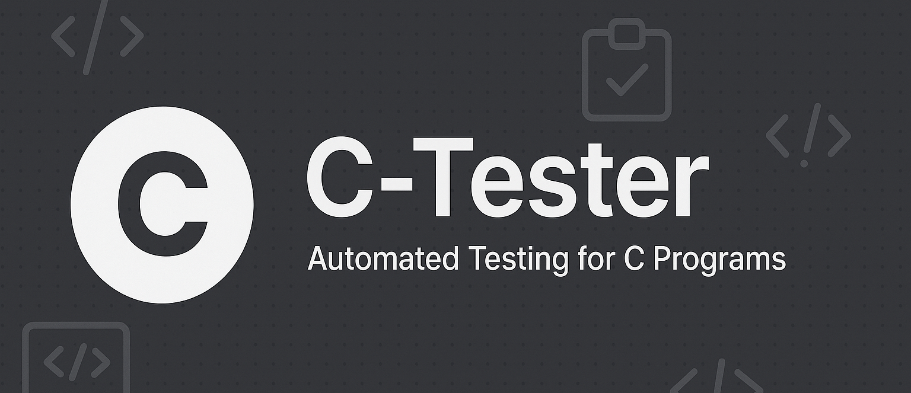
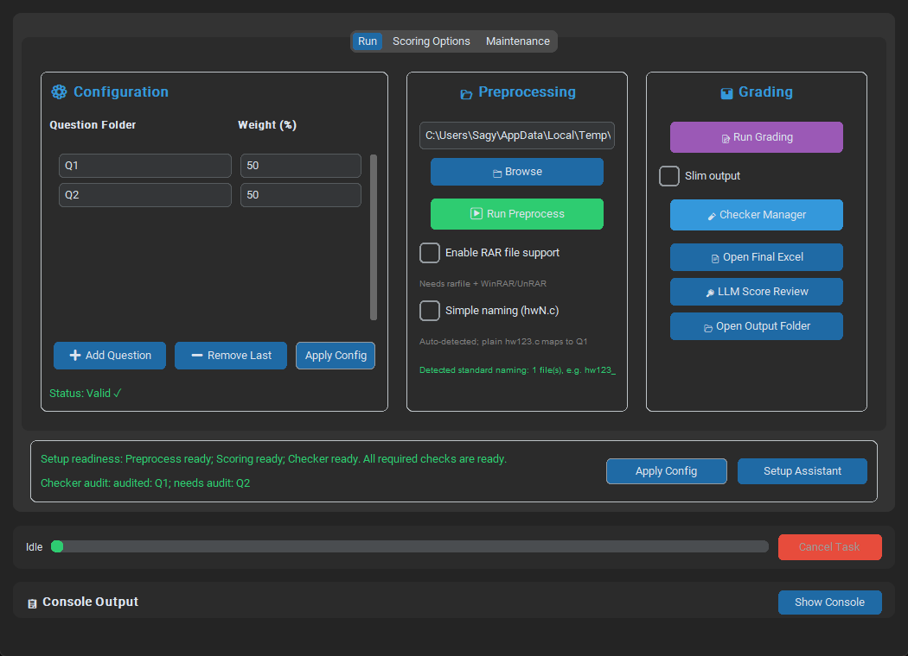
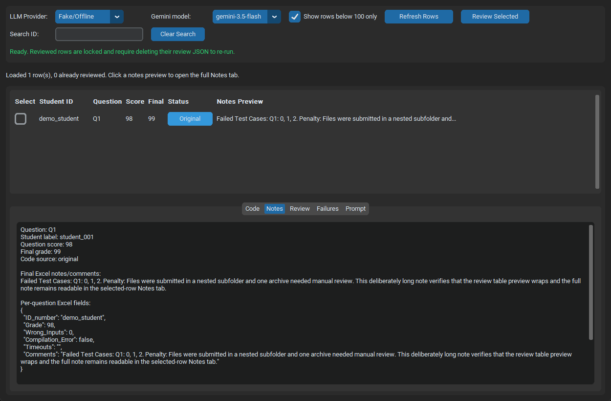
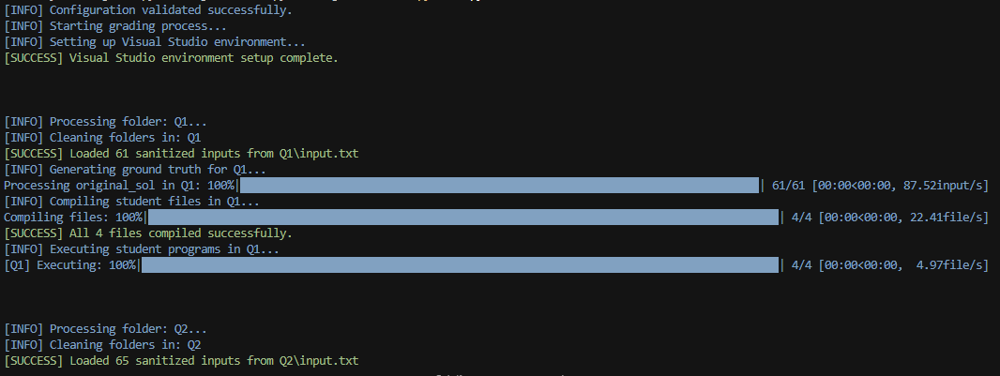

# C Auto Grader



*An automated tool for grading C programming assignments with GUI and CLI interfaces.*

[](https://www.python.org/)
[](https://www.apache.org/licenses/LICENSE-2.0)
[](https://github.com/sagy101/C-Tester/issues) 
<!-- Add other badges here if needed (e.g., build status, coverage, version) -->

This project automates the batch grading of multiple C programs. It sets up the Visual Studio C++ build environment, compiles and executes student C source files against a known-correct solution, compares outputs, and produces grading reports. Additionally, it generates Excel files with detailed grade breakdowns for each question folder as well as a consolidated final grade file for easy uploading (e.g. Moodle). 


## ✨ Features


*   **Preprocessing:** Extracts student submissions from nested zip files, organizes C files (`*_qN.c`) into question folders (`QN/C/`), and renames them based on student ID. Reports processing issues.
    *   **New:** Now supports RAR archives in addition to ZIP files.
    *   **New:** Supports simple naming pattern (`hwN.c`) as an alternative to the default pattern (`hwN_qN.c`).
*   **Automated Grading:**
    *   Sets up the Visual Studio C++ build environment (`vcvars64.bat`).
    *   Compiles student C code and a provided `original_sol.c` using `cl.exe`.
    *   Runs compiled student code against inputs from `input.txt`.
    *   Compares student output against the ground truth generated from `original_sol.c`.
    *   Robust timeout handling for infinite loops and long-running code (5-second limit).
    *   Detailed tracking of which inputs caused timeouts.
    *   Optional LLM compile-only repair for submissions that fail to compile, with bounded retries, a configurable repair penalty, and concise Excel notes.
*   **Excel Reporting:**
    *   Generates detailed Excel reports per question (`QN_grades_to_upload.xlsx`).
    *   Creates a consolidated `final_grades.xlsx` with weighted averages.
    *   Applies penalties based on preprocessing errors (`submit_error.txt`).
    *   Flexible penalty modes: apply once per student or cumulatively per error.
    *   Optional per-test-case deduction mode for question scoring.
    *   Lists failed test cases and timeout-causing inputs in the Comments column.
    *   Optional "slim" mode for final grades only.
    *   Post-scoring LLM review screen for explaining low scores and Excel notes from selected rows.
*   **Dual Interface:**
    *   Modern GUI (`python -m c_tester.gui`) for interactive use with guided setup, progress display, and cancellation.
    *   Robust CLI (`python -m c_tester.cli`) for scripting and automation.
*   **Advanced Validation:**
    *   Automatically validates Visual Studio and WinRAR paths before operations.
    *   Input validation for ZIP file selection and configuration settings.
    *   Clear status messages and button state management based on validation.
*   **Flexible Configuration:** Define questions, weights, penalties, and penalty modes in `c_tester/configuration.py` or override via the GUI.
*   **Cleanup Utilities:** Easily clear generated files (grades, output, C copies, build files, excels, repair files, and review files) via GUI or CLI.

---

## 🖼️ Screenshots

**Graphical User Interface (GUI):**



**Post-Scoring LLM Review Screen:**



**Command Line Interface (CLI) Example Output:**



---

## 🔧 Requirements

*   **Operating System:** Windows (uses `cmd` and Visual Studio's C++ compiler)
*   **Visual Studio 2022:** Community or higher, with C++ build tools installed.
    *   The path to `vcvars64.bat` is configured in `c_tester/configuration.py` (default: `C:\Program Files\Microsoft Visual Studio\2022\Community\VC\Auxiliary\Build\vcvars64.bat`) or from the GUI Setup Assistant.
*   **Python 3:** Tested with Python 3.10+. Tcl/Tk support required for the GUI (usually included with standard python.org installations - select "tcl/tk and IDLE" during setup/modify).
*   **For RAR support:** 
    *   The `rarfile` Python package (included in requirements.txt)
    *   WinRAR or UnRAR executable installed
    *   Path to WinRAR configured in `c_tester/configuration.py` (default: `C:\Program Files\WinRAR\UnRAR.exe`) or from the GUI Setup Assistant.
*   **For checker/scoring features:** `checker_config.json` is optional; if missing or invalid, built-in default checkers are used. Use the Checker Manager to review or save per-question checkers.
*   **For Gemini/LLM features:** `GOOGLE_API_KEY` must be configured if you use Gemini for checker setup, grading audit, compile repair, or post-scoring review. Offline/Fake mode is available for tests and demos only.
*   **Dependencies:** Listed in `requirements.txt`.

---

## ⚙️ Installation

1.  **Clone** or download the project files.
2.  **Install** required Python dependencies (preferably within a virtual environment):
    ```bash
    # Create and activate a virtual environment (optional but recommended)
    python -m venv .venv
    # Activate (Windows PowerShell):
    .\.venv\Scripts\Activate.ps1
    # Activate (Git Bash / Linux / macOS):
    # source .venv/bin/activate 
    
    # Install dependencies
    pip install -r requirements.txt
    ```
3.  **Configure** paths in `c_tester/configuration.py` or in the GUI Setup Assistant:
    * Visual Studio path (`vs_path`): Point to your Visual Studio's vcvars64.bat file
    * WinRAR path (`winrar_path`): Point to your UnRAR.exe or WinRAR.exe (only needed for RAR support)
4.  **Optional Gemini setup:** set `GOOGLE_API_KEY` before launching the GUI if you want live LLM features:
    ```powershell
    [Environment]::SetEnvironmentVariable("GOOGLE_API_KEY", "your_api_key_here", "User")
    ```
    Restart the terminal/GUI after setting it.
5.  **Prepare** Question Folders (see Structure below).

---

## 📁 Project Structure

*   `c_tester/`: Application package.
    *   `configuration.py`: Defines questions, weights, penalties, dependency defaults, and validation.
    *   `gui.py`: Graphical User Interface and Setup Assistant.
    *   `cli.py`: Command Line Interface.
    *   `preprocess.py`: Logic for extracting and organizing student submissions.
    *   `process.py`: Visual Studio setup, compilation, execution, output comparison, and compile repair integration.
    *   `create_excel.py`: Individual and final Excel report generation.
    *   `post_scoring_review.py`: Anonymized LLM review prompts, saved review state, and review artifact loading.
    *   `clear_utils.py`: Functions for cleaning generated files.
    *   `utils.py`: Logging utility and verbosity settings.
*   `tests/`: Unit, integration, GUI-flow, and synthetic e2e tests.
*   `examples/`: Public example assignment structure. Real homework inputs and reference solutions should stay local/private.
*   `requirements.txt`: Project dependencies.
*   `README.md`: This file.
*   `docs/`: Contains documentation assets (like screenshots).
*   `Q*/`: Local private folders for each real assignment question (e.g., `Q1/`, `Q2/`). These are ignored by Git for private assets.
    *   `input.txt`: Required file containing test case inputs (one per line).
    *   `original_sol.c`: Required file with the correct solution code.
    *   `C/`: **Initially empty.** Preprocessing places student `ID.c` files here.
    *   `grade/`: Generated text files with individual grades/errors.
        *   Now includes lists of inputs that caused timeouts.
    *   `output/`: Generated text files with student program output for each input.
    *   `review/`: Generated post-scoring LLM review JSON files. These are local/private and ignored by Git.
    *   `Q*_grades_to_upload.xlsx`: Generated Excel report for the question.
        *   Now includes a "Timeout_Inputs" column.
*   `final_grades.xlsx`: Generated consolidated final grade report.
    *   Now includes "Timeout_Inputs_Q*" columns and timeout information in Comments.
*   `submit_error.txt`: Generated by preprocessing, lists submissions with issues.

---

## 📥 Input Data Structure

### Preprocessing Input Zip File

For the **Preprocessing** step (via GUI or CLI) to work correctly, the input zip file you provide must adhere to the following structure:

<details>
  <summary>View Expected Input Zip Structure</summary>
  
  1.  The main zip file should contain **individual zip or RAR files** for each student submission.
  2.  Each inner archive's name **must end with the student's ID number**, preceded by an underscore (e.g., `Student Name_Assign1_123456789.zip` or `Student Name_Assign1_123456789.rar`). The part before the underscore and ID is not used by default but helps organization.
  3.  When an inner archive (e.g., `Student Name_Assign1_123456789.zip`) is extracted, it creates a folder (`Student Name_Assign1_123456789/`).
  4.  Inside this folder, the script looks for C files named in one of two formats:
      * **Default Pattern:** `some_filename_qN.c`, where `N` is the question number (e.g., `main_program_q1.c`, `my_solution_q2.c`).
      * **Simple Pattern:** `hwN.c`, where `N` is the question number (e.g., `hw1.c`, `hw2.c`). Use this pattern by enabling the `--simple-naming` flag in CLI or the corresponding option in GUI.
  5.  **Alternatively**, if no matching C files are found directly inside the student's folder, the script will look for them inside **exactly one subdirectory** within the student's folder (e.g., `Student Name_Assign1_123456789/Submission/main_program_q1.c`). It will not search deeper than one subfolder level.
      
  **Example:**
  ```
  main_submissions.zip          <-- Input zip file
  │
  ├── FirstName_LastName_Assign1_123456789.zip
  │   │ # Extracted to folder FirstName_LastName_Assign1_123456789/
  │   └── main_code_q1.c
  │   └── helper_functions_q2.c
  │
  ├── Another_Student_Assign1_987654321.rar   <-- Now supports RAR files
  │   │ # Extracted to folder Another_Student_Assign1_987654321/
  │   └── SubmittedFiles/          <-- Single subfolder is OK
  │       ├── program_q1.c
  │       └── library_q2.c
  │       └── readme.txt
  │
  └── Problem_Student_Assign1_111223344.zip
      │ # Extracted to folder Problem_Student_Assign1_111223344/
      └── source.c                <-- File doesn't match _qN.c pattern, will cause error in submit_error.txt
  ```
  
  Submissions that don't follow this structure (e.g., missing ID in archive name, C files not matching `_qN.c` pattern, C files nested too deep, no C files found) **will not be processed correctly** and will be reported with errors in `submit_error.txt`.
</details>

### Question Folders (`Q*`)

For the **Grading** step, each question folder (e.g., `Q1`, `Q2`) defined in the configuration must exist and contain:

*   `input.txt`: File containing test case inputs (one per line).
*   `original_sol.c`: File with the correct solution code for generating ground truth output.
*   `C/`: Student files named `ID.c`. This can be filled manually, but the recommended flow is to use preprocessing, which creates/updates these files from the submissions zip.

Before opening the GUI for a full run, make sure:

1. Python dependencies are installed.
2. `Q*/input.txt` and `Q*/original_sol.c` exist for every configured question.
3. Visual Studio C++ Build Tools are installed and `vs_path` is valid, or can be validated from the GUI.
4. If preprocessing submissions, the main submissions zip is available and follows the expected archive structure.
5. If using RAR or Gemini features, configure WinRAR/UnRAR and `GOOGLE_API_KEY` respectively.

The Setup Assistant validates prerequisites by workflow:

* **Preprocess:** Python dependencies, valid assignment configuration, submissions zip, and WinRAR/UnRAR when RAR support is enabled.
* **Scoring:** Python dependencies, local `Q*/input.txt` and `Q*/original_sol.c`, `Q*/C/`, valid weights, Visual Studio C++ compiler, checker config/default checker availability, and compile-repair API readiness if compile repair is enabled.
* **Checker Manager:** Python dependencies and checker configuration/defaults. Gemini-powered suggestions and audits additionally require `GOOGLE_API_KEY`; manual/Fake checker workflows can run without it.
* **LLM Compile Repair:** Visual Studio compilation prerequisites plus `GOOGLE_API_KEY` for Gemini, or the Fake provider for deterministic tests/demos.
* **Post-Scoring LLM Review:** Existing Excel/grade/output artifacts from grading plus `GOOGLE_API_KEY` for Gemini, or the Fake provider for deterministic tests/demos.

---

## 🚀 Usage

Choose the interface that suits your needs:

### Graphical User Interface (GUI)

Recommended for interactive use.

1.  **Run** the GUI (ensure dependencies are installed and environment is activated):
    ```bash
    python -m c_tester.gui
    ```
2.  **Use Setup Assistant (Recommended):**
    *   On first launch, or by clicking **Setup Assistant**, follow the guided setup screen.
    *   Step through assignment folders, dependency validation, submissions zip detection, grading options, and readiness checks.
    *   Use the built-in actions to create missing `Q*/C/` folders and choose local private `input.txt` / `original_sol.c` files.
    *   Click **Next To Main Screen** once assignment setup is valid. The main screen still shows a readiness banner and gates actions until required checks pass.
3.  **Configure (Advanced / Optional):**
    *   The "Configuration" section displays the current questions and weights in a table.
    *   Modify folder names and weights directly in the table.
    *   Use "Add Question" to add a new empty row or "Remove Last" to delete the bottom row.
    *   Edit the "Submission Error Penalty" value in its field.
    *   Check "Apply penalty per error (cumulative)" if you want penalties to add up for each error a student has. Leave unchecked to apply only a single penalty per student regardless of error count.
    *   Choose "Test Case Scoring" mode:
        *   `percentage`: `ceil(correct / total * 100)`.
        *   `per_error_deduction`: deduct the configured amount per failed test case, floored at 0.
    *   Optional "LLM Compile Repair" can be enabled for submissions that fail to compile. It attempts compile-only fixes, stores fixed candidates separately, applies the configured repair penalty after successful repair, and adds concise repair notes to Excel.
    *   **Important:** After making any changes, click **"Apply Config"**. This will parse and validate your inputs.
        *   The **Status** label below the buttons will indicate if the current configuration is "Valid", "INVALID" (with details in a popup), or if there are "Unapplied changes".
        *   The "Apply Config" button will be highlighted if changes are unapplied.
        *   The "Run Preprocess" and "Run Grading" buttons are **disabled** if the configuration is invalid or has unapplied changes.
4.  **Set Dependencies:**
    *   The "Dependencies" section allows you to configure paths to required executables:
        *   **Visual Studio Path**: Path to your Visual Studio environment's vcvars64.bat file (required for grading).
        *   **WinRAR Path**: Path to your WinRAR.exe or UnRAR.exe (only required if RAR support is enabled).
    *   After setting or changing paths, click the corresponding "Apply" button to validate the path.
    *   The "Run Grading" button will be disabled until a valid VS path is applied.
    *   The "Run Preprocess" button will be disabled if RAR support is enabled but no valid WinRAR path is applied.
5.  **Use the Actions:**
    *   **Preprocessing:** 
        *   Click "Browse" to select the main submissions zip file (containing individual student zips).
        *   Optionally check "Enable RAR file support" if student submissions include RAR files.
        *   Click "Run Preprocess" to begin processing (button will be disabled if no zip file is selected or if RAR support is enabled without a valid WinRAR path).
    *   **Grading:** 
        *   Check the "Slim Output" box if you only want the final `final_grades.xlsx` to contain `ID_number` and `Final_Grade` columns.
        *   Click "Run Grading" to start the compilation, execution, and report generation (button will be disabled until VS path is validated).
        *   Click **LLM Score Review** after grading to open a score/notes table. Select unlocked rows, choose Gemini or Fake/Offline, and request a grader-facing explanation of deductions.
    *   **Clear Actions:** Click the desired button. Actions related to specific questions (Clear Grades, Output, C Files, Clear Repair, Clear Reviews, All) use the *currently applied GUI question list*. **Clear Reviews** unlocks saved post-scoring LLM review rows so they can be reviewed again.
    *   **Output:** Logs, progress descriptions, and the progress bar appear at the bottom. Long tasks can be cancelled.

### Command Line Interface (CLI)

Suitable for scripting or users preferring the command line. Uses the static configuration set in `c_tester/configuration.py`.

1.  **Configure:** Edit `c_tester/configuration.py` to define:
    * `questions`: List of question folder names
    * `folder_weights`: Dictionary mapping question folders to their weight percentages
    * `penalty`: Points to deduct for submission errors
    * `per_error_penalty`: Boolean flag to determine if penalties apply once per student or accumulate per error
    * `vs_path`: Path to Visual Studio environment batch file
    * `winrar_path`: Path to WinRAR executable for RAR file extraction
2.  **Run** the CLI with commands:

<details>
  <summary>View CLI Commands</summary>
  
  *   **Preprocess submissions:**
      ```bash
      # Without RAR support
      python -m c_tester.cli preprocess --zip-path <path_to_your_zip_file.zip>
      
      # With RAR support (requires valid WinRAR path in c_tester/configuration.py)
      python -m c_tester.cli preprocess --zip-path <path_to_your_zip_file.zip> --rar-support
      ```
      Extracts nested zips, organizes C files into `QN/C/`, renames them to `ID.c`, and generates `submit_error.txt`. Requires the input zip file to follow the structure detailed in the "Input Data Structure" section.
      
      When using `--rar-support`, the tool will automatically validate the WinRAR path before proceeding.
      
  *   **Run grading:**
      ```bash
      # Full output (Default)
      python -m c_tester.cli run
      # Slim output (ID & Final Grade only in final_grades.xlsx)
      python -m c_tester.cli run --slim 
      # Apply penalty per error (can accumulate)
      python -m c_tester.cli run --per-error-penalty
      # Deduct 2 points per failed test case instead of percentage scoring
      python -m c_tester.cli run --test-scoring-mode per_error_deduction --test-error-deduction 2
      # Enable LLM compile-only repair with a 10-point repaired-question penalty
      python -m c_tester.cli run --llm-compile-repair --llm-compile-repair-penalty 10 --llm-compile-repair-max-attempts 3
      # Both options can be combined
      python -m c_tester.cli run --slim --per-error-penalty
      ```
      The tool will automatically validate the Visual Studio path before proceeding with compilation and grading.
      
      Compiles, executes, compares outputs, and generates grade files and Excel reports based on `c_tester/configuration.py`. 
      * Use `--slim` for minimal final report.
      * Use `--per-error-penalty` to apply penalties for each error a student has (instead of just once).
      * Use `--test-scoring-mode per_error_deduction` with `--test-error-deduction` to deduct a fixed amount per failed test case.
      * Use `--llm-compile-repair` to attempt compile-only LLM repairs for compilation failures. Original student files are not overwritten; repaired candidates are stored under `Q*/llm_fixed/`.

  *   **Clear generated files:**
      ```bash
      # Clear specific items: grades, output, c, excels, build, repair, reviews
      python -m c_tester.cli clear <item_to_clear> 
      # Example: Clear build files (.exe, .obj)
      python -m c_tester.cli clear build 
      # Clear LLM compile repair candidates and repaired outputs
      python -m c_tester.cli clear repair
      # Clear saved post-scoring LLM reviews
      python -m c_tester.cli clear reviews
      
      # Clear grades, output, repair artifacts, review artifacts, excels, and build files:
      python -m c_tester.cli clear all 
      ```
      *(Note: `clear all` does not clear the `C/` folders.)*

  *   **View help:**
      ```bash
      python -m c_tester.cli --help
      ```
</details>

---

## 📖 How It Works (Briefly)

1.  **Preprocessing (`preprocess` command / GUI button):**
    *   Validates WinRAR path if RAR support is enabled.
    *   Extracts main zip -> extracts inner student zips.
    *   Identifies student ID from folder name (`..._ID`).
    *   Finds `*_qN.c` files (directly or in one subfolder).
    *   Copies files to `QN/C/ID.c`.
    *   Logs errors to `submit_error.txt`.
2.  **Grading (`run` command / GUI button):**
    *   Validates Visual Studio path before proceeding.
    *   Sets up MSVC environment.
    *   For each question folder in config:
        *   Reads `input.txt`.
        *   Compiles and runs `original_sol.c` to get ground truth outputs.
        *   Compiles student `ID.c` files in parallel.
        *   If LLM compile repair is enabled, failed compilations are retried up to the configured limit using compile-only candidate fixes.
        *   Runs compiled student code against inputs in parallel.
            *   Enforces 5-second timeout per input.
            *   Aggressively terminates hung processes.
            *   Tracks which inputs caused timeouts.
        *   Compares student output to ground truth.
        *   Writes individual grade/output files to `grade/` and `output/`.
    *   Cleans up `.obj` files.
3.  **Excel Generation (Part of `run`):**
    *   Reads grade files for each question.
    *   Generates `QN_grades_to_upload.xlsx` with timeout information.
    *   Merges data, calculates weighted final grades.
    *   Parses `submit_error.txt` and applies penalties based on configuration:
         *   Either once per student (default) or per-error (accumulates for multiple errors).
         *   Shows detailed penalty calculation in comments (e.g., "-5% x 3 = -15%" for per-error mode). 
    *   Generates `final_grades.xlsx` (full or slim format) with:
        *   Timeout inputs per question.
        *   Comprehensive Comments column listing failed, timeout, penalty, and compile-repair cases.
4.  **Post-Scoring Review (GUI only):**
    *   Reads `final_grades.xlsx`, per-question Excel files, grade text, student code, repaired code when available, and parsed discrepancy blocks.
    *   Sends only selected rows to the LLM. The real student ID is removed from the prompt and replaced with an anonymous label such as `student_001`.
    *   The prompt includes anonymized code, notes, grade text, per-question/final Excel fields without `ID_number`, parsed failed inputs, raw student output by input, expected/reference output by input, active grading policy, and compile-repair metadata with IDs redacted.
    *   The active grading policy tells the LLM whether failed inputs use percentage scoring or a fixed per-input deduction, the fixed deduction amount, whether submission errors are cumulative or once per student, the submission-error penalty amount, and compile-repair penalty settings.
    *   The LLM returns JSON with a short summary, whether the deduction looks plausible, grouped root causes, inline line comments, fix guidance to reach full score, and a risk note.
    *   Shows the code with Pygments-backed C syntax highlighting, failed inputs, expected/actual outputs, and the LLM explanation with inline line comments.
    *   Saves each review under `Q*/review/ID.json`; reviewed rows are locked until those generated review files are cleared.

### Advanced LLM Features

The GUI has three separate LLM workflows:

* **Checker Manager:** Suggests semantic checker JSON, tests it against ground-truth outputs, saves per-question checker configuration, and can sample already graded rows for audit. It can use Gemini or Fake/Offline.
* **LLM Compile Repair:** During grading, compile failures can be repaired with bounded compile-only LLM attempts. The original student file is never overwritten; candidates go under `Q*/llm_fixed/`, repaired outputs under `Q*/llm_fixed_output/`, and the Excel comments include the repair note and penalty.
* **LLM Score Review:** After grading, opens a score/notes table. The grader selects rows, and the LLM receives anonymized code, parsed failed inputs, raw student output, expected/reference output, grade text, Excel fields without `ID_number`, notes, active grading policy, and compile-repair metadata with IDs redacted. It returns a concise summary, grouped root causes, inline code comments, and a suggested fix to reach full score.

The default Gemini model is `gemini-3.5-flash` through `DEFAULT_GEMINI_MODEL`; use the GUI model picker or `GEMINI_MODEL` environment variable to choose another model available to your key. Fake/Offline is deterministic and intended for regression tests and demos, not real grading judgment.

To refresh the README review screenshot from a synthetic local fixture:

```bash
python tools/capture_review_screenshot.py
```

---

## ✅ Testing

Run the full local test suite from the repository root:

```bash
python -m unittest discover -s tests -p "test_*.py"
```

For a quick import/syntax check after structural changes:

```bash
python -m compileall -q c_tester tests
```

The repository also keeps public examples under `examples/`; real homework inputs, reference solutions, submissions, generated Excel files, and PDFs are local/private and ignored by Git.

### Privacy Checks

Run the privacy audit before pushing:

```bash
python tools/privacy_audit.py HEAD
python tools/privacy_audit.py HEAD --history
```

Optional local pre-commit hook:

```bash
pip install -r requirements-dev.txt
pre-commit install
```

The hook runs `python tools/privacy_audit.py --staged` and blocks staged private artifacts. GitHub Actions also runs the same audit on PRs and pushes with full history checkout.

---

## 🐛 Troubleshooting

<details>
  <summary>View Troubleshooting Tips</summary>

*   **Missing `cl.exe` or Build Tools:**
    Verify that Visual Studio with C++ build tools is installed and the path to `vcvars64.bat` in `c_tester/configuration.py` or the GUI Setup Assistant is correct. Ensure you are running the script in a terminal where the VS environment can be activated (e.g., Developer Command Prompt or a standard terminal after `vcvars64.bat` has been sourced).

*   **Missing or Incorrect `input.txt` / `original_sol.c`:**
    Ensure each configured question folder (`Q1/`, etc.) contains these required files.

*   **Compilation Failures:**
    Check the `.txt` files in the `grade/` subfolders for detailed `cl.exe` error messages.

*   **Configuration Errors (CLI Startup / GUI Apply):**
    The tool validates `c_tester/configuration.py` (for CLI) or the GUI inputs. Ensure:
    *   All folders listed in `questions` exist in the project root.
    *   `folder_weights` keys exactly match the `questions` list.
    *   Weight percentages sum *exactly* to 100.
    *   Penalty (GUI) is a non-negative integer.

*   **Path Validation Errors:**
    *   **Visual Studio Path**: Ensure the path to vcvars64.bat is correct and the file exists.
    *   **WinRAR Path**: If RAR support is enabled, ensure the path to UnRAR.exe or WinRAR.exe is correct.
    *   Both paths are validated before operations begin to prevent runtime errors.

*   **GUI / Tkinter Issues:**
    *   **Error: `ModuleNotFoundError: No module named 'tkinter'`:** Your base Python installation is missing Tcl/Tk support.
        *   **Solution:** Run your Python installer again, choose "Modify", ensure "tcl/tk and IDLE" is checked. Then, **recreate your virtual environment** (`.venv`) by deleting the old folder, creating a new one (`python -m venv .venv`), activating it, and reinstalling dependencies (`pip install -r requirements.txt`). Test with `python -m tkinter`.
    *   **Network Errors during `pip install`:** Check firewalls, proxies, or antivirus settings that might block connections to PyPI (pypi.org).

*   **RAR Extraction Issues:**
    *   **Error: `rarfile module not installed`:** Run `pip install rarfile` to install the required package.
    *   **Error: `UnRAR executable not found`:** Update the `winrar_path` in `c_tester/configuration.py` to point to your WinRAR installation:
        ```python
        # For UnRAR.exe (command-line utility)
        winrar_path = r"C:\Program Files\WinRAR\UnRAR.exe"
        # Or for WinRAR.exe (GUI application)
        winrar_path = r"C:\Program Files\WinRAR\WinRAR.exe"
        ```
    *   If using a non-standard installation path, locate your WinRAR installation and update the configuration accordingly.

</details>

---

## 📜 License

This project is licensed under the Apache License, Version 2.0. See `LICENSE` and `NOTICE`.

In short: you may use, modify, and distribute the project, including commercially, but redistributed copies or derivative works must keep the Apache-2.0 license text, copyright/attribution notices, and the `NOTICE` file where required. Private/internal use does not require a public citation.

---

Happy Testing and Grading!